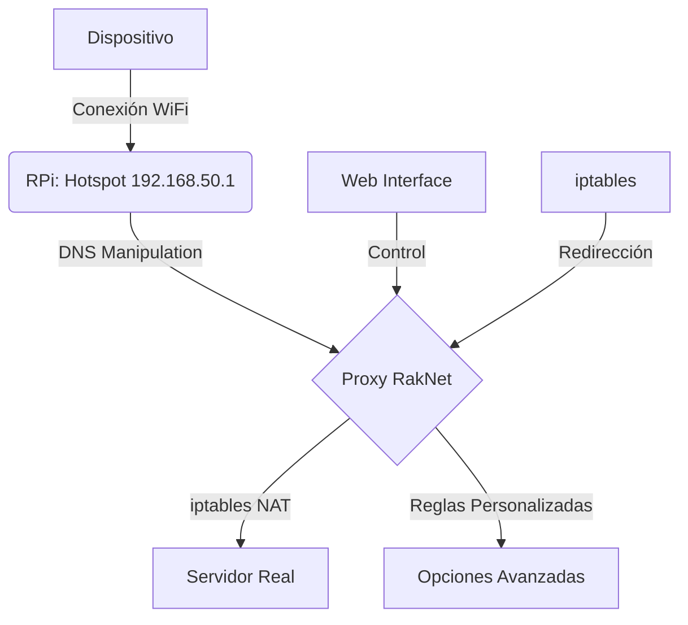

# 🦌 Odocoileus - Minecraft Bedrock Server Redirector

**Transforma una Raspberry Pi en un proxy inteligente para servidores Minecraft Bedrock Edition**  
*Controla y redirige tráfico de Minecraft mediante una interfaz web moderna*

[](https://opensource.org/licenses/MIT)
[](https://www.python.org/)
[](https://www.raspberrypi.org/)

## 🚀 Características Principales
- **Proxy RakNet Completo**: Intercepta y redirige paquetes de Minecraft Bedrock
- **Gestión Avanzada de Red**:
  - **NAT con iptables**: Redirección de puertos y enmascaramiento de IP
  - **Reglas de Firewall Persistente**: Configuración sobrevive a reinicios
- **Interfaz Web de Control**: Configuración en tiempo real desde cualquier dispositivo
- **Gestión Integrada de DNS**:  
  ```play.galaxite.net``` → ```tuserver.com```
- **Hotspot WiFi Automático**: Crea tu propia red para dispositivos móviles

## 🖥️ Hardware
- Raspberry Pi W
- Ethernet Adapter Unno
- MicroSD 8G

## ⚙️ Arquitectura del Sistema


## Instalacion

### Requisitos previos:

  1. Git instalado (generalmente viene preinstalado en Raspberry Pi OS, pero si no lo tienes, ejecuta):
      ```
      sudo apt update && sudo apt install git -y
      ```

  2. Clonar el repositorio:
     
     a. Abre una terminal en tu Raspberry Pi (o conéctate por SSH).
     b. Clona el repositorio usando el comando git clone seguido de la URL del repositorio (copia la URL desde GitHub):
     ```
       git clone https://github.com/jmirsteinban/Odoco.git
     ```

     Se creara la carpeta Odoco con todo lo nesesario
